# Watt Tracker

A comprehensive React frontend for the Watt Tracker microservices-based energy monitoring system. This application provides real-time energy consumption tracking, device management, and intelligent alerting for household energy usage, and energy saving tips from AI model.

## Screenshots

### Watt Tracker Microservices Architecture

- How to calculate wattage and price inside watt-tracker-microservices
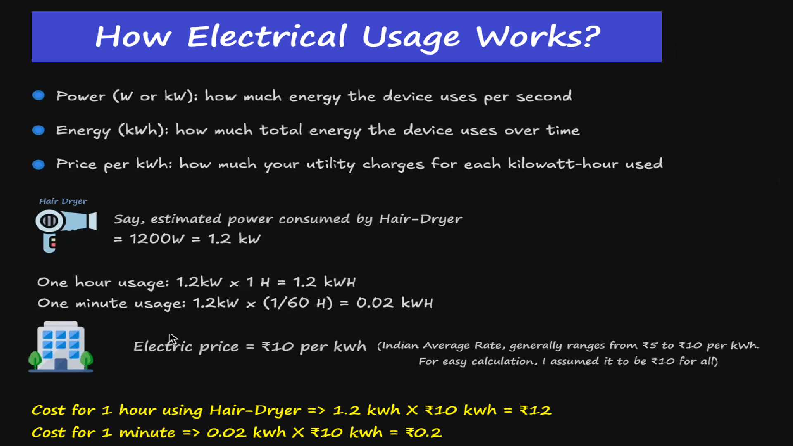

- The requirements and assumptions made for the watt-tracker-microservices
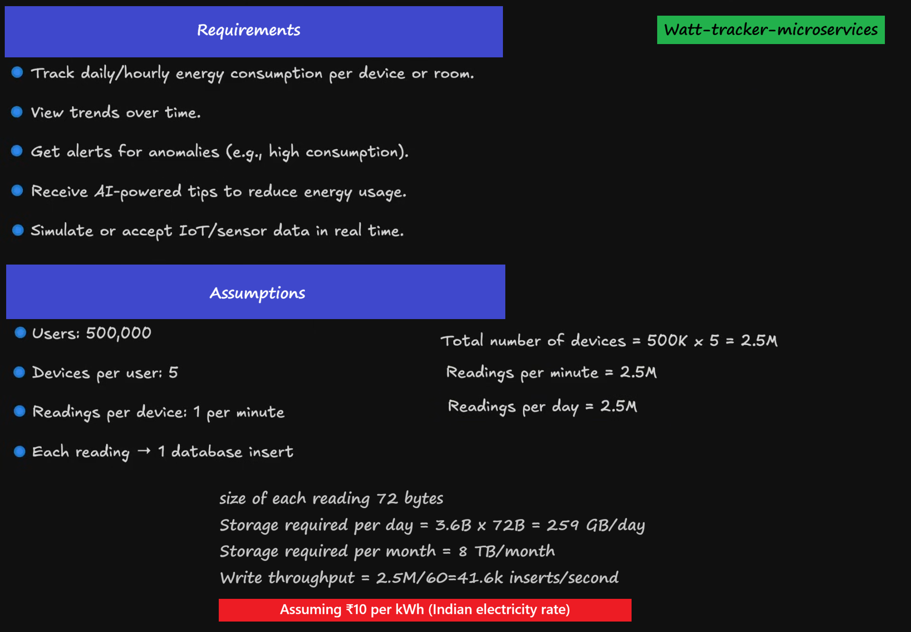

- How services will look alike


- How eureka-services will look alike
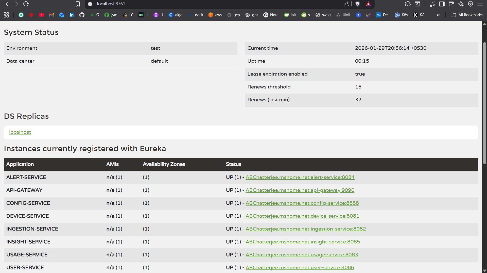

### Watt Tracker React Frontend

- How Watt Tracker App Login Page =>
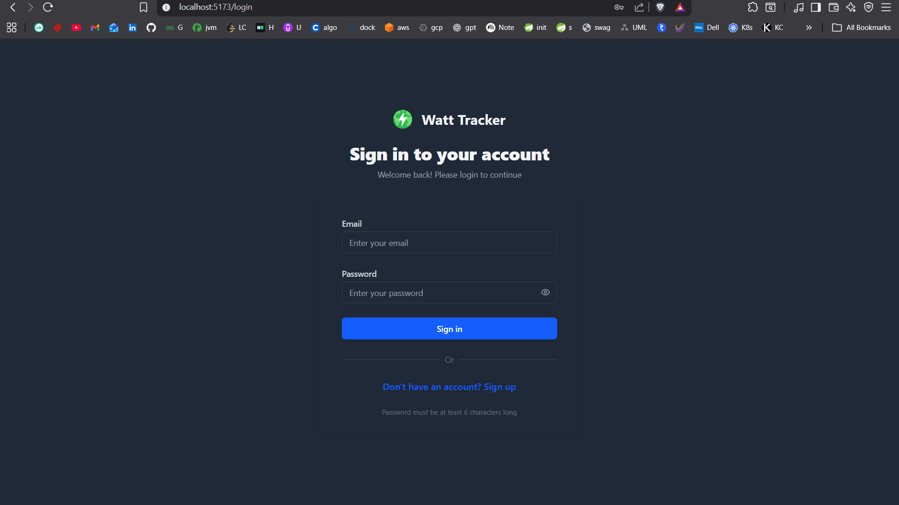

- How Watt Tracker App Dashboard Page =>
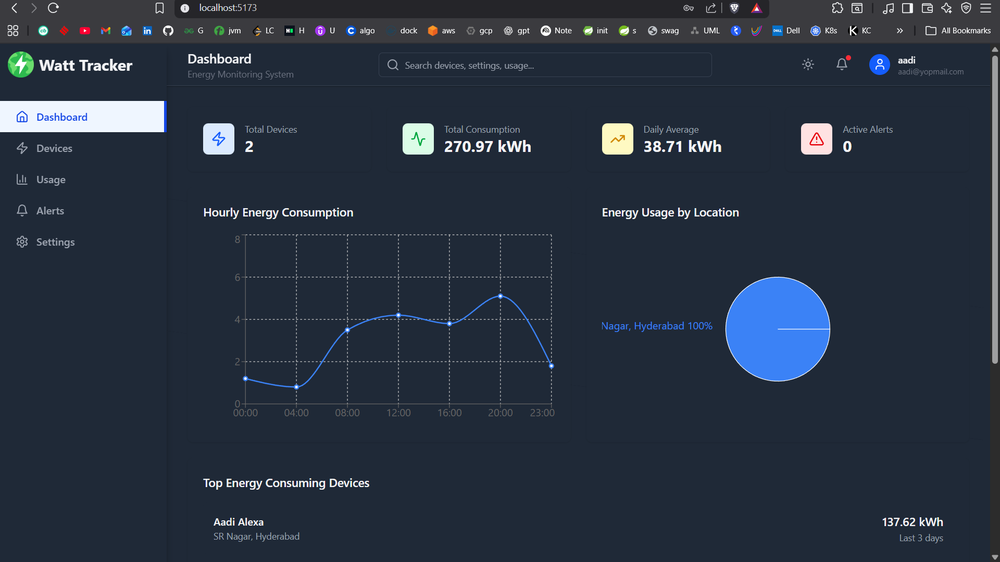

- How Watt Tracker App Devices Page =>
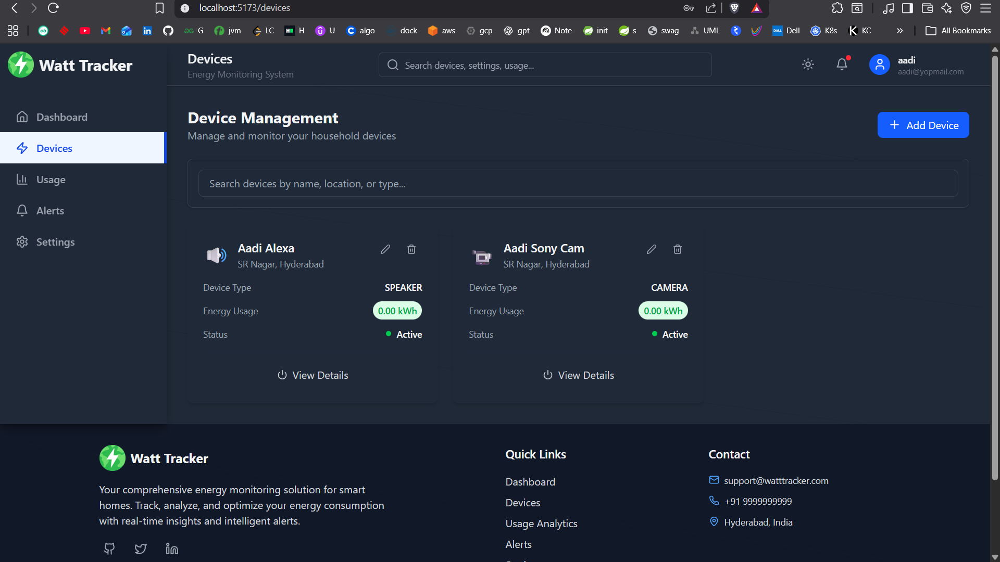

- How Watt Tracker App Usage Analytics Page =>
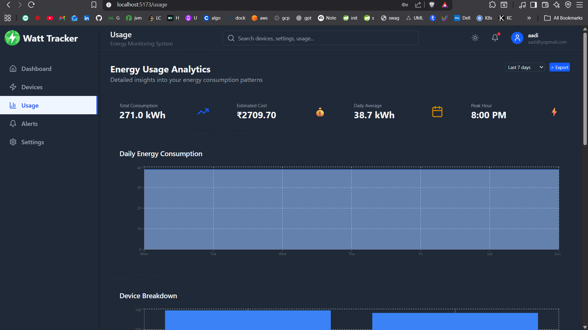

- How Watt Tracker App Alerts Page =>
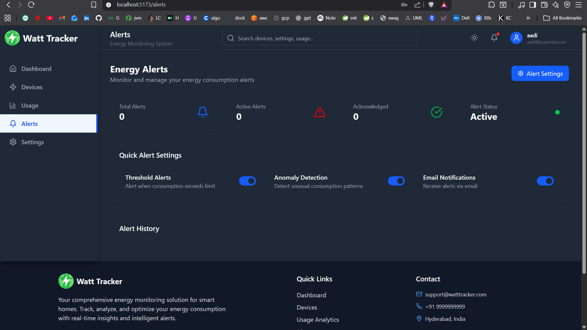

- How Watt Tracker App Settings Page =>
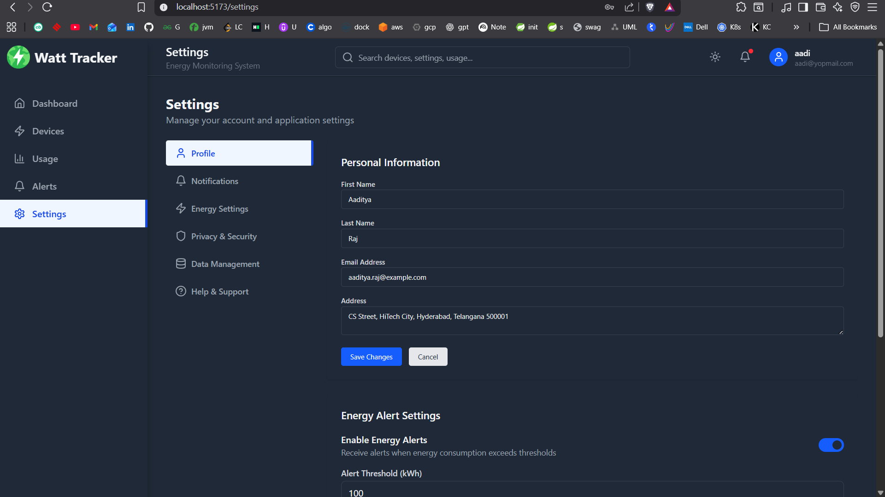

### External Tools

- How Kafka-UI looks =>
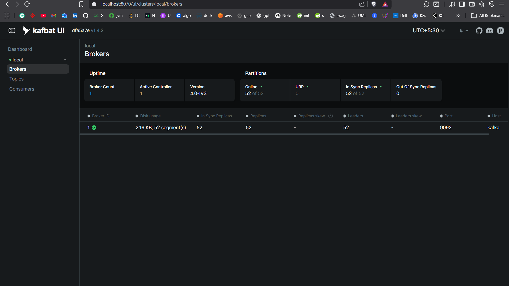

- How InfluxDB looks =>
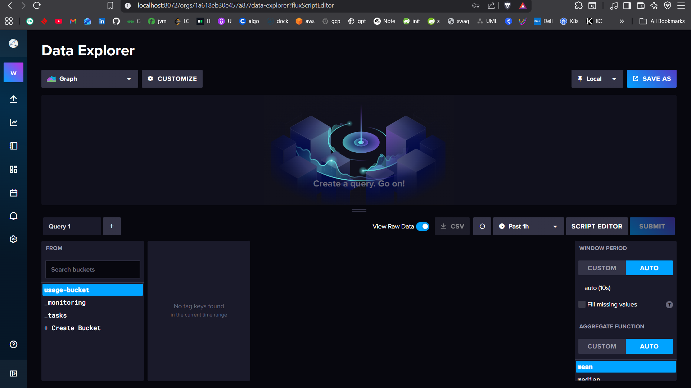

- How mailpit looks =>
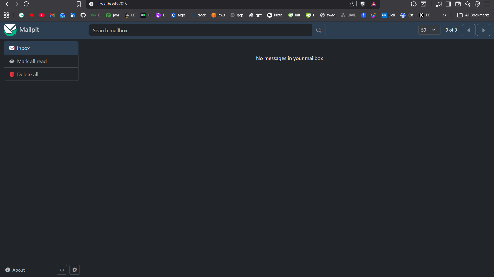


## Features

### 🏠 Dashboard
- **Real-time Energy Monitoring**: Live energy consumption data with interactive charts
- **Device Statistics**: Overview of all connected devices and their energy usage
- **Consumption Trends**: Hourly, daily, and monthly energy consumption patterns
- **Quick Stats**: Total devices, consumption, daily averages, and active alerts

### 📱 Device Management
- **Device Catalog**: View all household energy-consuming devices
- **Device Types**: Support for Smart TVs, Refrigerators, AC units, Washing Machines, and more
- **Energy Usage Tracking**: Per-device energy consumption monitoring
- **Device Status**: Real-time status and health monitoring
- **Add/Edit Devices**: Easy device registration and management

### 📊 Usage Analytics
- **Detailed Consumption Reports**: Comprehensive energy usage analytics
- **Time-based Analysis**: Hourly patterns, daily summaries, monthly comparisons
- **Cost Tracking**: Estimated energy costs and savings opportunities
- **Device Breakdown**: Energy consumption distribution by device and location
- **Export Functionality**: Download reports in various formats

### 🚨 Alert System
- **Threshold Alerts**: Customizable energy consumption thresholds
- **Anomaly Detection**: AI-powered unusual consumption pattern detection
- **Device Status Alerts**: Notifications for device offline/online status
- **Peak Hour Monitoring**: Alerts during high consumption periods
- **Alert History**: Complete log of all past alerts and acknowledgments

### ⚙️ Settings & Configuration
- **User Profile**: Personal information and preferences
- **Notification Preferences**: Email, SMS, and push notification settings
- **Energy Settings**: Custom thresholds, goals, and monitoring preferences
- **Privacy & Security**: Data management and security settings

## Technology Stack

- **React 19.2.0** - Modern React with latest features
- **TypeScript** - Type-safe development
- **Tailwind CSS** - Utility-first CSS framework
- **React Router** - Client-side routing
- **Recharts** - Interactive charts and visualizations
- **Lucide React** - Beautiful icon library
- **Axios** - HTTP client for API communication

## Prerequisites

- Node.js 18+ 
- npm or yarn
- Backend microservices running (see main project README)

## Getting Started

1. **Install Dependencies**:
   ```bash
   npm install
   ```

2. **Start Development Server**:
   ```bash
   npm run dev
   ```

3. **Build for Production**:
   ```bash
   npm run build
   ```

4. **Preview Production Build**:
   ```bash
   npm run preview
   ```

## API Integration

The frontend connects to the following microservices:

- **Device Service** (Port 8081): Device registration and management
- **Ingesion Service** (Port 8082): Ingesion management
- **Usage Service** (Port 8083): Energy consumption data and analytics
- **Alert Service** (Port 8084): Alert management and notifications 
- **Insight Service** (Port 8085): Insight management
- **User Service** (Port 8086): User management and profiles

- **API Gateway Service** (Port 9090): API gateway
- **Eureka Server** (Port 8761): Service Discovery
- **Config Server** (Port 8888): Github config management

## Configuration

### Environment Variables
Create a `.env` file in the root directory:

```env
VITE_API_BASE_URL=http://localhost:9090
```

### API Endpoints
- `GET /api/v1/user/{id}` - Get user information
- `GET /api/v1/device/user/{userId}` - Get user devices
- `GET /api/v1/usage/{userId}` - Get energy usage data
- `GET /api/v1/alert/user/{userId}` - Get user alerts

## Features in Detail

### Dashboard Components
- **Energy Consumption Cards**: Real-time consumption metrics
- **Interactive Charts**: Line charts for hourly consumption, pie charts for device distribution
- **Top Devices List**: Highest energy-consuming devices
- **Alert Summary**: Active and recent alerts

### Device Management
- **Grid Layout**: Responsive card-based device display
- **Device Icons**: Visual representation by device type
- **Energy Indicators**: Color-coded consumption levels
- **Quick Actions**: Edit, delete, and view device details

### Usage Analytics
- **Multi-dimensional Charts**: Area charts, line charts, bar charts
- **Time Period Selection**: 7 days, 30 days, 3 months, 1 year
- **Comparative Analysis**: Month-over-month comparisons
- **Device-level Breakdown**: Detailed consumption per device

### Alert Management
- **Severity Levels**: High, medium, low priority alerts
- **Alert Types**: Threshold exceeded, anomaly detection, device offline
- **Acknowledgment System**: Mark alerts as read/acknowledged
- **Quick Settings**: Toggle alert types on/off

## Responsive Design

The application is fully responsive and works seamlessly on:
- **Desktop** (1200px+): Full-featured experience
- **Tablet** (768px-1199px): Optimized layout
- **Mobile** (320px-767px): Touch-friendly interface

## Performance Optimizations

- **Lazy Loading**: Components loaded on demand
- **Chart Optimization**: Efficient data rendering
- **Caching Strategy**: API response caching
- **Bundle Splitting**: Optimized JavaScript bundles

## Security Features

- **Type Safety**: Full TypeScript coverage
- **Input Validation**: Form validation and sanitization
- **Secure API Communication**: HTTPS and CORS handling
- **Error Boundaries**: Graceful error handling

## Development

### Project Structure
```
src/
├── components/     # Reusable UI components
├── pages/         # Page components
├── services/      # API service layer
├── types/         # TypeScript type definitions
└── assets/        # Static assets
```

### Code Style
- **ESLint**: Code linting and formatting
- **Prettier**: Code formatting
- **TypeScript**: Strict type checking
- **Component Patterns**: Functional components with hooks

## Contributing

1. Follow the existing code style
2. Add TypeScript types for new features
3. Write tests for new components
4. Update documentation for API changes

## Future Enhancements

- **Real-time WebSocket Integration**: Live energy data streaming
- **Mobile App**: React Native mobile application
- **Advanced Analytics**: Machine learning-powered insights
- **Integration with Smart Home Devices**: Direct device connectivity
- **Energy Provider Integration**: Real-time pricing and billing

## Support

For issues and questions:
1. Check the existing documentation
2. Review the API endpoints
3. Verify backend service status
4. Check browser console for errors

# MicroServices Port
```
device-service = 8081
ingestion-service = 8082
usage-service = 8083
alert-service = 8084
insight-service = 8085
user-service = 8086

api-gateway = 9090
eureka = 8761
config-service = 8888
```

# After running project find
```
Mysql => workbench with root/password
Mailpit => http://localhost:8025/
Kafka UI => http://localhost:8070/
InfluxDB => http://localhost:8072/ with admin/admin123
Eureka => http://localhost:8761
Frontend of watt-tracker App => http://localhost:5173/login
```